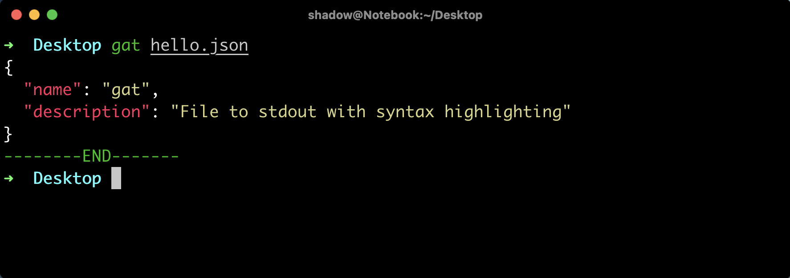

# Gat

Trying to replicate bat which is written in rust.
I dont have plans to implement pagination for now.
At present intention is only to

1. Read a file passed as argument

2. Output to stdout with syntax highlighting using chroma

## Usage

Download relevant binary from release.
Program accepts single argument which is file name

```shell
> ./gat package.json
```


